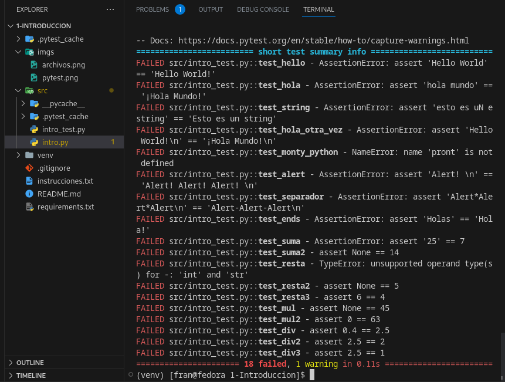
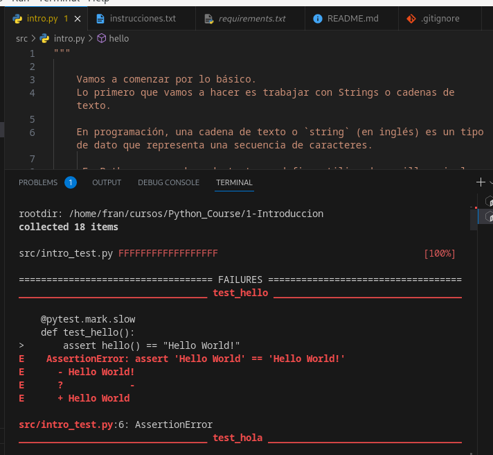

# 1 - Primeros Pasos 

  ## 1.1 Usando Python por primera vez (a travez de la consola)
 
Primero que nada, vamos a usar el Entorno de Python con algunas Operaciones básicas.

Abre una terminal e ingresa: `py` si eres usuario Windows o `python3` si eres usuario Unix.

  

Deberias tener un mensaje aprecido a este:

  
```
Python 3.11.1 (main, Jan 6 2023, 00:00:00)

[GCC 12.2.1 20221121 (Red Hat 12.2.1-4)] on linux

Type "help", "copyright", "credits" or "license" for more information.

>>>

```
**Nota:** Recuerda que el mensaje va a variar dependiento del OS que utilices.
<br/>
¿Ves esas tres flechas?

`>>>`

  <br/>

Eso es un **prompt**, especificamente un prompt de Python, y simplemente indica que:

  

1. Estás es un espacio vitual de Python, es decir, todo lo que escribas de ahí en más debe ser bajo las reglas de este lenguaje (ya las iremos viendo poco a poco).
<br/>

2. Está esperando algun tipo de comando de parte del usuario (es decir, espera a que tú le des una instrucción).

  

Ahora escribe en el prom9t: `print("hello world")` 

Deberias verlo asi:

  
```
>>>  print("hello world")
```
y presiona Enter y deberías obtener:
```
hello world
```
  
  
  

No parece muy útil ¿verdad?

Que tal ahora:

  
```
>>> 472 * 195
```
¿Cuál fue el resultado?

  

Mejor, pero tampoco particularmente útil, es más fácil usar la calculadora de tu celular.

  

En la realidad, casi nunca usamos el entorno de Python de esta manera, pero nos sirve para hacer pequeños juegos que nos ayudan a concocer mejor este lenguaje, aunque para programar de verdad necesitaremos hacer uso de nuestro editor de código.

  


-----

## 1.2 Primer Programa

  


Por tradicón, el _Hello World!_ es el primer programa que realizas cuando aprender un nuevo lenguaje, herramienta o framework, etc. Su popularidad se debe al ser la primera frase de prueba que aparece en el libro "_El Lenguaje de Programación C" / "The C Programming Language_" de 1978 escrito por Brian Kernighan y Dennis Ritchie, aunque nadie conoce el origen exacto de esta frase.

  

Vamos a usar la terminal, abrela en el escritorio y crea una carpeta (comando `mkdir`) y llamémosla "hello_world" (no uses caracteres especiales ni espacios). 

Entra en la carpeta (comando `cd`/hello_world ) ahora vamos a crear un archivo Python (comando `touch`) y llamemos al archivo "hello_world.py", asegúrate que este ahí el archivo (usa el comando `ls`). Finalmente abrelo con el editor (puedes usar el comando `code .`o `subl .`).

 ----
 ### Break --- ¡¡¡Importante!!!

Vez que el archivo termina en **.py**

Para cada lenguaje el archivo debe tener una terminación distinta, en lenguaje **C** lo arhivos terminan en **.c**, en **JavaScript** en  **.js**, **Rust** en **.rs** y asícada uno tiene su propia terminación que le indica a la computadora que tipo de archivo es.
 
---
Para crear este programa necesitamos uná función que viene por defecto en Python que se llama "_print_" y se escribe `print()` dentro de python.

  

1. Escribe _Hello World!_ entre los paréntesis.

2. Corre el programa usando la terminal de la siguiente manera:

    2.1 Si estas en Windows o Mac `py hello_world.py`

    2.2 En Linux `python3 hello_world.py `

  

Seguro te apareció algo así:

  

```python

  

Traceback (most recent call last):

File "/home/FranSabt/Dev/sierra-vita-front/src/a.py", line 1, in <module>

print(hello_world)

^^^^^^^^^^^

NameError: name 'hello_world'  is  not defined

```

  
<br>
¡Felicidades! Tienes tu primer **BUG**
<br>
  

_Bug_ es el termino que usamos para para referirnos a errores en el código. ¿Por qué? 

Averigualo aquí: https://www.youtube.com/watch?v=5sNuPYJpSCI

  

Verás, para que imprima ese mensaje en la consola/terminal teníamos que rodear el mensaje entre comillas, simples o dobles, cualquiera de las dos maneras funciona.

  

```python

print("Hello World!")

print('Hello World!')

  

"""

En lo particular alentamos a los alumnos a usar las comilllas dobles,
esto es porque en ciertos lenguajes de tipado fuerte como C++, C#,
Java entre otros, la doble comilla indica un
"string o cadena de caracteres" y las comilla simple un dato tipo
'char o caracter unico/aislado'.

"""

```

  

¡Verdad que ahora si!

  

Hagamos algo distinto

  

Realiza una suma, para esto usa el operador de suma `+`:

  

```python

print("15 + 36")

```

  

Seguro obtuviste:

  

```bash

1536

```

  

Seguro te andas rascando la cabeza pensando que esto no tiene sentido.

Verás, todo es culpa de las comillas.

 Cuando las comillas rodean los carecteres los transforman en un tipo de dato que se llama `String` o _Cadena de Texto_ o _Cadena de Caracteres_ en español, para que operen como números deben estar sin las comillas.

  

```python

print(15 + 36)

```
  
<br/>

Vamos a seguir jugando con **print()** . 

Ahora 

  
  
```python

print("Hola! " * 5) # Estamos dejando un espacio deliberadamente dentro del string.
```

Deberias obtener algo así:

```
>>> Hola! Hola! Hola! Hola! Hola!
```

*¡Cambia el número a ver que pasa!*
*¡Sigue jugando con ese print!*

Y si ahora hacemos algo así:
```python

print("Hola! Hola! Hola! Hola! Hola! " sep='-') 
```

Veamos:

```
  File "<stdin>", line 1
    print("Hola" sep="*")
          ^^^^^^^^^^
SyntaxError: invalid syntax. Perhaps you forgot a comma?

```

Ups! Otro bug!!!

Quizas el íngles no sea tu fuerte, pero el mensaje de error nos suguiere que nos faltó una coma.

```python

print("Hola! Hola! Hola! Hola! Hola! ", sep='-') 
```
<br>
¿Que obtuviste?
<br/>

**print()** tiene muchas funciones útiles que permiten dar formato a las salidas en consola. No vamos a aprenderlas todas hoy ni todas en este curso, pero si algunas de las más comunes y úiles.


----
## 1.3  Ejercicios
----
Primer ve a: *aqui dir de repo*

 1. Has un fork del repositorio.
 2. Descarga el repositorio desde tú Github usando la clave **ssh** del repositorio.
 3. Abre la carpeta en VSCode o directamente abre una terminal dentro de la carpeta.
 4. Usa el comando `git checkout -b <nombrede_nuevo_branch>`.
 5. Ahora usa el comando `python3 -m venv venv`(Windows) o `py -m venv venv`(Unix) para crear un nuevo entorno virtual.
 6. Activa el entorno virtual usando en `venv\Scripts\Activate.ps1`(Windows) o `venv/bin/activate`(Unix)
 6.2  Puedes escribir la primera letra de seccion del comando y auto-completar con "Tab"
 7. Instala los requerimientos con el comando `pip install -r requirements.txt`


Perfecto, tenemos nuestro entorno virtual, ya te hablare de él más adelante, por ahora basta con que sepas que el entorno virtual garantiza que todos trabajemos con las mismas herramientas.

En la carpeta `src` (por source) vas a encontrar dos archivos, el primero se llama `intro.py`, ahí estan una serie de ejecicios que debes resolver.

Algunos están llenos de errores, otros faltan por completar.

Los ejercicios se ven asi:
```python
def hello() -> str:
	# corrige el string	
	return  "Hello World"
```

 - Nunca toques la línea del `def nombre_del_de(f):`
 - En estos ejercicios, corrige lo que continua a la palabra `return`

Otros se ven asi:
```python
def alert() -> None:
	print('Monty Python')
```

 - En este caso corrije lo que esta dentro de la función print().

Si por alguna razón se arruina el archivo, usa el comando `git checkout main` y vuelve a usar `git checkout -b <nombre_de_nuevo_branch>`.

### Usando los Test

Con el comando `pytest` vamos a correr los test automatizados de los problemas que se plantean.

Este archivo contiene 18 tests para realizar.
```

Cada 'F' indica un test fallido y será reemplazado por puntos cada vez que el test sea exitoso.

```

En un test fallido, puedes ver:
	

 1. La función dónde se ejecutó y falló.
 2. El resultado esperado.
 3. El resultado obtenido.

Lee con calma la consola para saber donde esta el error.

**Imagen aqui

Y recuerda que puedes hacer varios branch del archivo y practicar cuanto desees.

